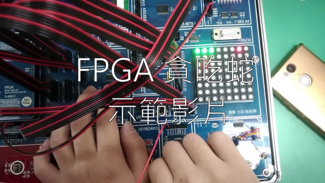

# FPGA-Snake 貪吃蛇
作者: 107321003 107321009

## 輸入/輸出元件 Input / output unit
   1. 8x8 LED 矩陣，顯示蛇與蘋果位置。
   2. 七段顯示器，顯示得分。
   3. 4 Bits Switch ，控制蛇移動方向。
   4. DIP Switch ，重置遊戲按鈕。

## 實作之功能
   1. 蛇(綠色LED)可以通過按鈕控制往上下左右前進，一開始定義方向為右。
   2. 當蛇頭撞到牆壁，結束遊戲。
   3. 當蛇頭撞到自己身體，結束遊戲。
   4. 隨機生成蛇所要吃的蘋果(用紅色LED燈代替)，如果蛇吃到蘋果，分數加一，再次生成新蘋果位置。
   5. 分數用七段顯示器計算。

## 程式模組說明

### output
- [7:0] data_r, data_g, data_b ->接到 8x8 LED 矩陣  
- reg [3:0] comm ->接到 8x8 LED 矩陣的 S0~S2 和 EN  
- reg [6:0] d7_1 ->接到七段顯示器  
- reg [1:0] COMM_CLK ->接到七段顯示器的 COM3 和 COM4  
### input
- [3:0] direction ->接到 4 Bits Switch  
- clk,clear ->接到 DIP Switch

### module 說明
- module snake() -> 遊戲主邏輯
- module divfreq() -> 除頻器，用於製造視覺暫留
- module divfreq_mv() -> 除頻器，用於控制蛇移動速度
- module segment7() -> BCD 數字轉七段顯示器輸出

## 未來展望
   1. 如果蛇吃到蘋果，蛇長度加一，目前因記憶體限制無法實作。
   2. 蛇移動的速度隨著得分增加而加快，目前因為除頻器無法使用變數讀入除頻器的函式進行if條件判斷而無法實作。
   3. 蛇本身有生命值，碰到牆壁第一次不會死亡，會變色進入虛弱狀態，因Demo時間不足無法成功實作。
   
## 示範影片 Demo video
[https://youtu.be/eTh6KHmho1Y](https://youtu.be/eTh6KHmho1Y)  

